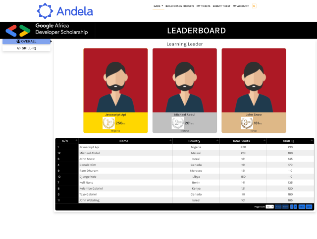
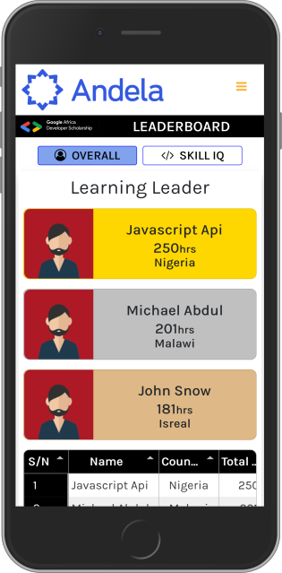

# GADS Leaderboard

This leaderboard project is a modification of the existing leaderboard on the GADS website. The changes made are listed below
- Adding a profile picture to the top three scores
- Making the leaderboard table responsive on all screens
- Adding a sidebar navigation for the main categories on large screens and horizontal top navigation for smaller screens
- Animating the leader cards

The leaderboard table data was created via javascript and the data was gotten from a JSON object locally created in the script file. It can be easily modified to fetch data from an API also. 

## Screenshots

## Live Demo

[Hosted Link](naughty-engelbart-6220f2.netlify.app)

## Author

Longe Temitope
- Github: [@tamsay](https://github.com/tamsay)
- Twitter: [@longetope](https://twitter.com/longetope)

## 🤝 Contributing

Contributions, issues and feature requests are welcome!

Feel free to check the [issues page](https://github.com/tamsay/GADS_Leaderboard/issues)

## Show your support

Give a ⭐️ if you like this project!

## Acknowledgments

Project inspired by HNG7 Internship